# Adrian Szmajewski | CV Portfolio

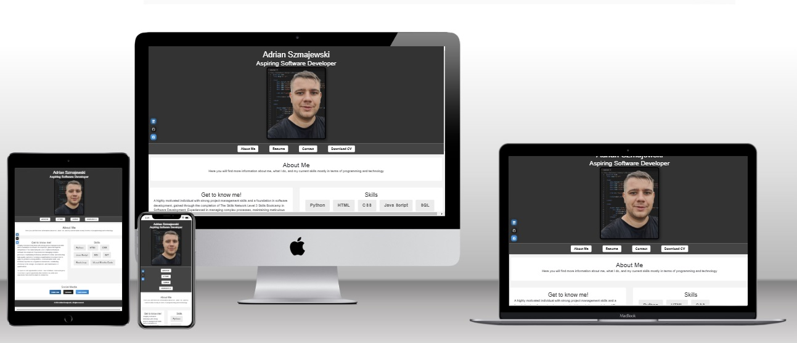

## 🎯 Introduction
Welcome to my personal CV portfolio website! 🚀 This project showcases my skills, experience, and projects in an interactive and structured format. Designed with **HTML and CSS**, the site provides a smooth and visually appealing experience across different devices.

This portfolio serves as a digital resume, allowing visitors to explore my background, technical skills, and previous projects while offering easy navigation and accessibility.


🔗 **Live Site:** [View my CV portfolio here](https://adrian77792.github.io/CV/Adrian%20Szmajewski%20CV/Adrian_Szmajewski.html)

🔗 **GitHub Repository:** [Check out the code](https://github.com/adrian77792/CV)

---
## 📌 Table of Contents
- [Introduction](#-introduction)
- [User Experience (UX)](#-user-experience-ux)
  - [Target Audience](#target-audience)
  - [User Goals](#user-goals)
  - [Design](#design)
  - [Color Scheme](#color-scheme)
- [Features](#-features)
  - [Home Page](#home-page)
  - [Skills](#skills)
  - [Projects](#projects)
  - [Contact](#contact)
- [Future Features](#-future-features)
- [Technologies Used](#-technologies-used)
- [Deployment](#-deployment)
- [Testing](#-testing)
- [Credits](#-credits)
- [Acknowledgments](#-acknowledgments)

---
## 🎨 User Experience (UX)

### Target Audience
- Employers and recruiters looking for a software developer.
- Professionals interested in collaborating on projects.
- Tech enthusiasts exploring my portfolio and projects.

### User Goals
- **First-time visitors:** Easily understand my skills and professional background.
- **Returning visitors:** Stay updated with my latest projects and achievements.

### Design
The design focuses on:
- **Clean and modern UI:** Minimalistic, professional layout.
- **Easy navigation:** Clearly structured menu for seamless browsing.
- **Fully responsive:** Optimized for desktop, tablet, and mobile.

### 🎨 Color Scheme
The portfolio follows a modern and visually appealing color scheme:
- **Background:** Light gray for a clean and professional look.
- **Primary Color:** Dark blue (#2C3E50) to create a strong and elegant feel.
- **Accent Color:** Vibrant cyan (#1ABC9C) for buttons and highlights, adding contrast and engagement.
- **Text Color:** Dark gray (#333333) to ensure readability.
- **Hover Effects:** Soft transitions to enhance user interaction.

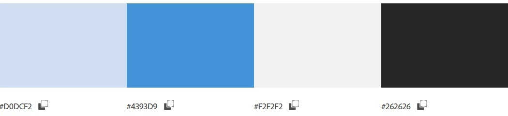

---
## 🔥 Features

### 🏠 Home Page
- Brief introduction and professional summary.
- Call-to-action buttons directing to various sections.

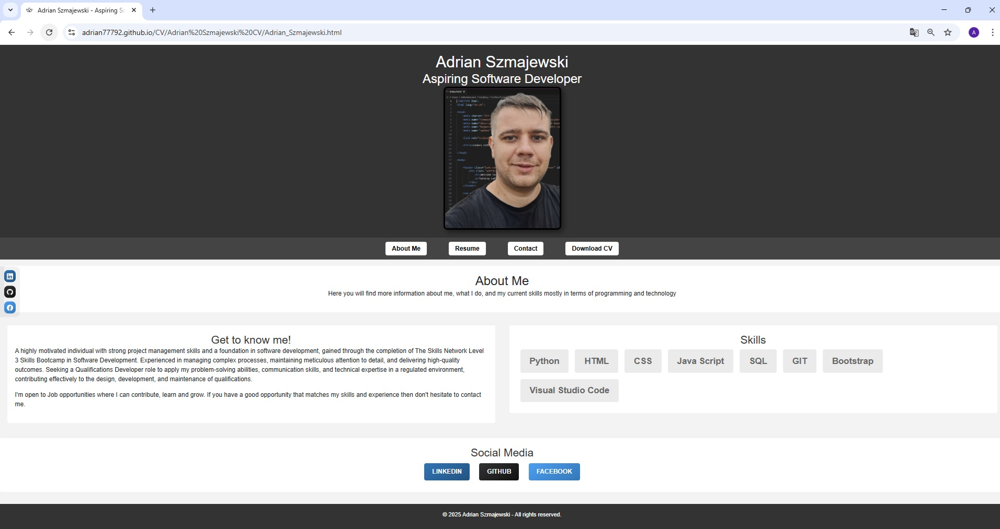

### 💡 Skills
- List of programming languages, frameworks, and tools.
- Visual representation for better understanding.

### 💻 Projects
- Showcases selected projects with descriptions, images, and links to GitHub repositories.
- Highlights technologies used for each project.

### 📩 Contact
- Contact form allowing users to reach out easily.
- Links to LinkedIn, GitHub, and other professional profiles.

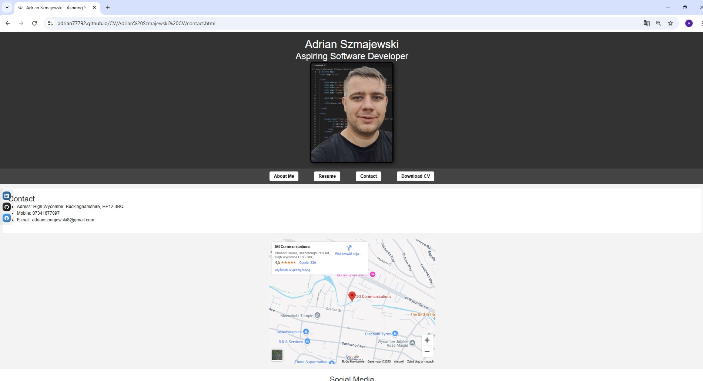
---
## 🚀 Future Features
- **Downloadable CV**: Provide a DOCX version of my resume.
- **Dark mode toggle**: Improve accessibility for users.
- **More interactive elements**: Enhance user engagement.

---
## 🛠 Technologies Used
- **HTML & CSS**: Page structure and styling.
- **Bootstrap**: Ensuring responsiveness.
- **GitHub Pages**: Hosting the website.
- **Font Awesome**: Icons for better visual appeal.
- **Google Fonts**: Custom typography.

---
## 🌍 Deployment
The website is hosted using **GitHub Pages**:
1. Code is stored in a GitHub repository.
2. GitHub Pages is enabled in the repository settings.
3. The live site is accessible via the provided URL.

To clone the repository locally:
```sh
 git clone https://github.com/adrian77792/CV.git
```

---
## ✅ Testing
- **Responsiveness:** Verified across different devices.
- **Cross-browser compatibility:** Tested on Chrome, Firefox, Edge, and Safari.
- **Navigation usability:** Ensured smooth and intuitive browsing.
- **Form validation:** Checked for proper input handling.

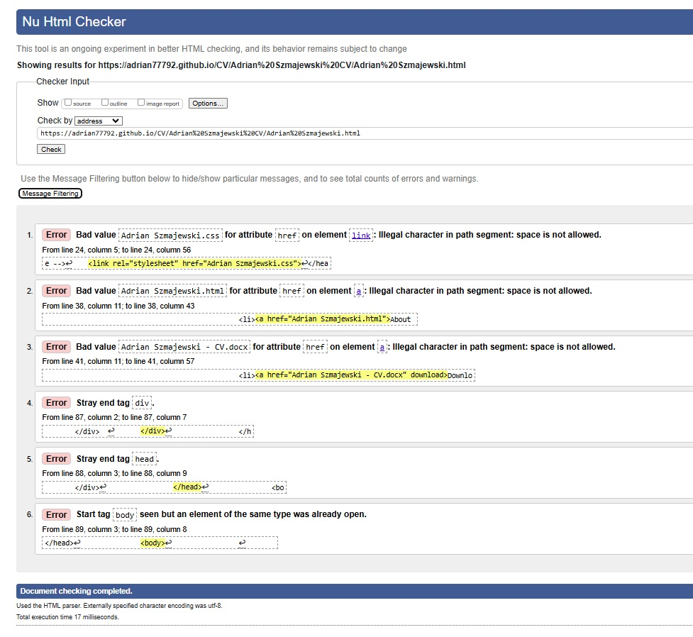
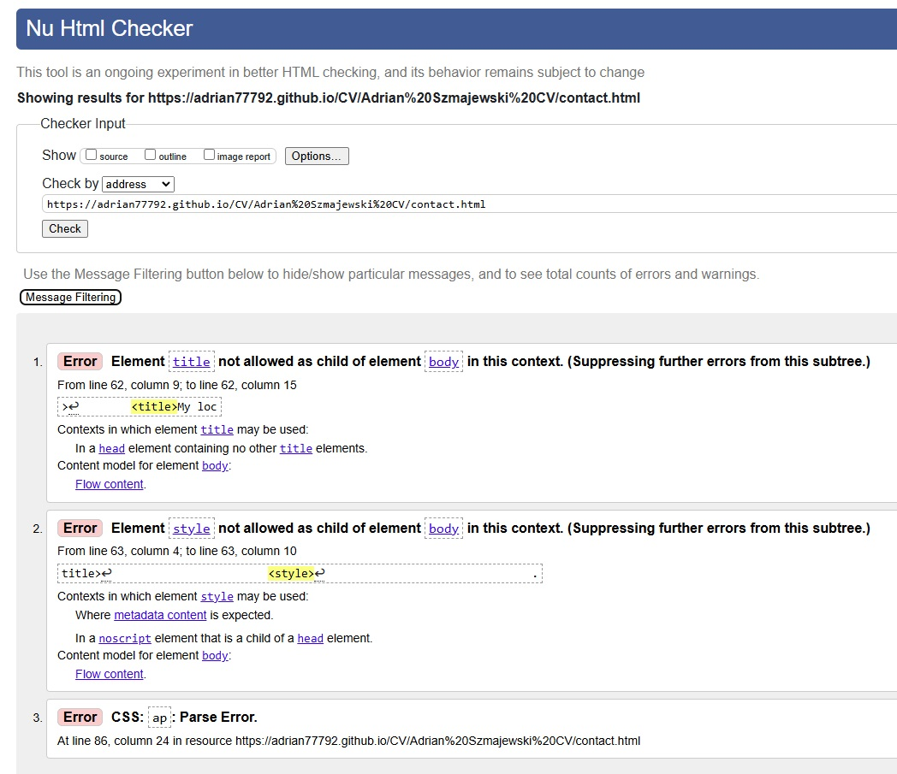
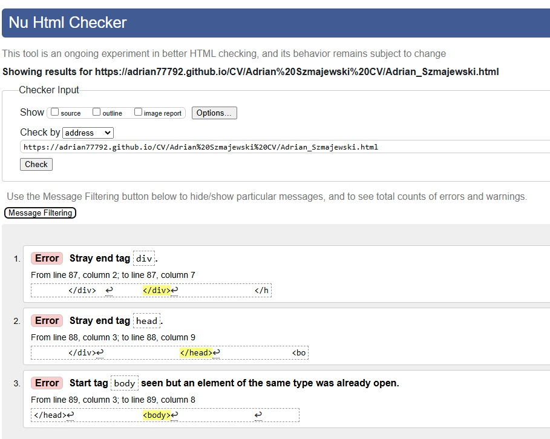
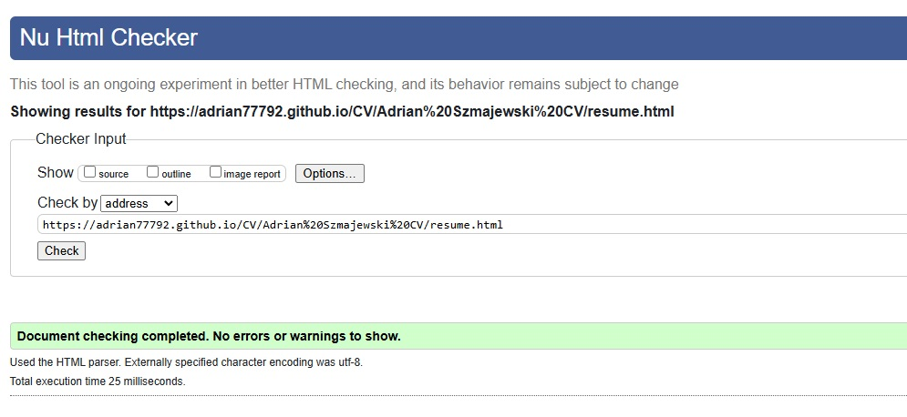
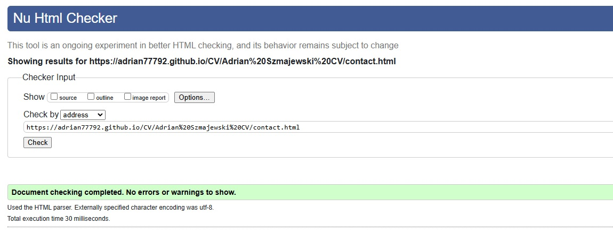
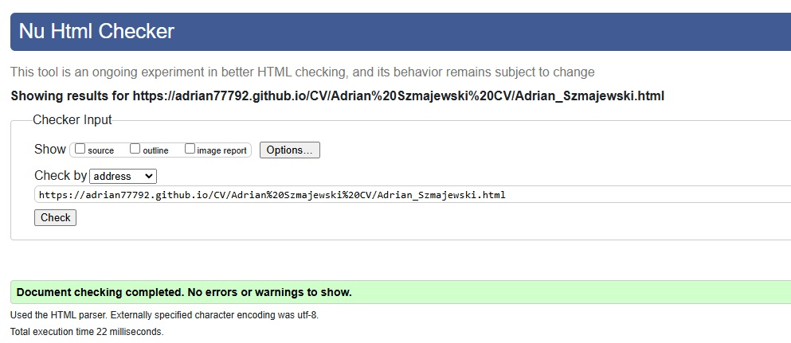
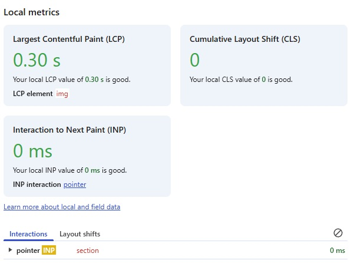
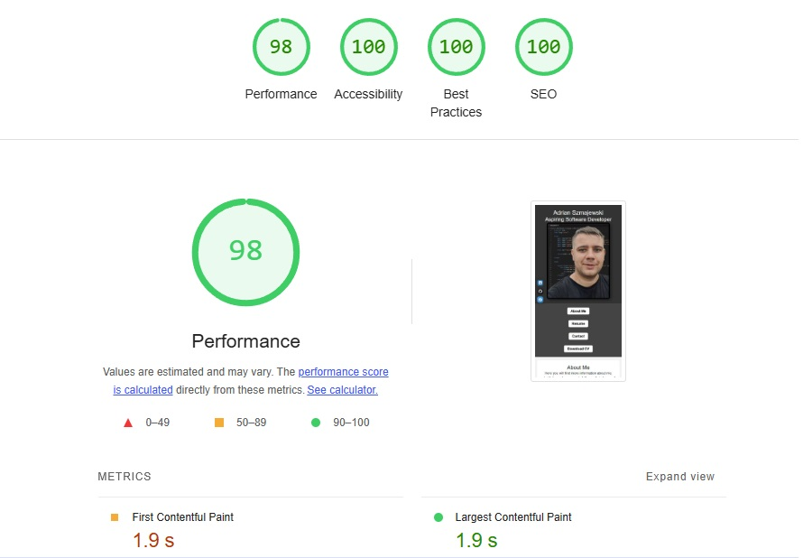
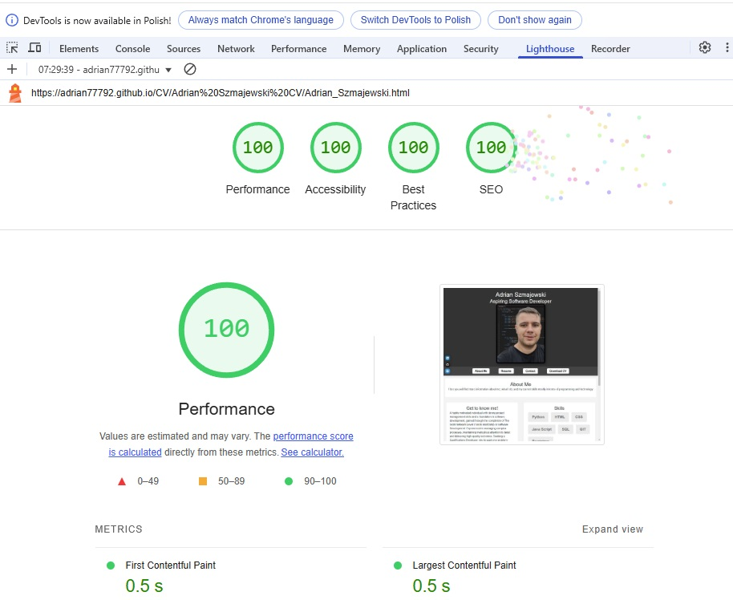

---
## 📚 Credits
- **Icons & Fonts:** Google Fonts, Font Awesome.
- **Inspiration & Resources:** Various online tutorials and tech communities.

---
## 🙌 Acknowledgments
- **Mentors & Peers:** For guidance and feedback.
- **Tech Community:** For valuable learning resources.

📌 *© 2025 Adrian Szmajewski - All rights reserved.*

