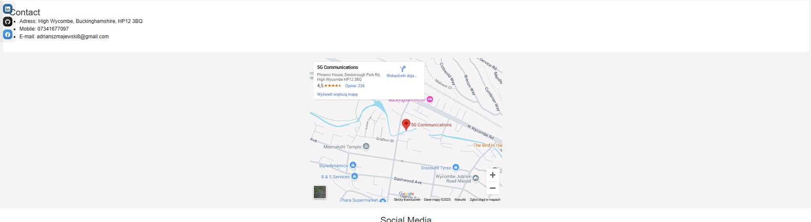

# Adrian Szmajewski | CV Portfolio


## 🎯 Introduction
Welcome to my personal CV portfolio website! 🚀 This project showcases my skills, experience, and projects in an interactive and structured format. Designed with **HTML and CSS**, the site provides a smooth and visually appealing experience across different devices.

This portfolio serves as a digital resume, allowing visitors to explore my background, technical skills, and previous projects while offering easy navigation and accessibility.


🔗 **Live Site:** [View my CV portfolio here](https://adrian77792.github.io/CV/adrian_szmajewski_cv/index.html)

🔗 **GitHub Repository:** [Check out the code](https://github.com/adrian77792/CV)

## 🎯 Project Goals

- **Showcase Skills and Experience**  
  The primary goal of this portfolio is to present my technical skills, professional background, and accomplishments in a clear and structured way.

- **Create a Professional Online Presence**  
  This project aims to establish my personal brand and serve as an easily accessible online portfolio for potential employers, clients, or collaborators.

- **Facilitate Communication**  
  The website includes contact forms and links to my social media profiles, enabling easy communication and collaboration opportunities.

- **Stand Out in the Job Market**  
  A well-designed, interactive portfolio helps differentiate me from other candidates, increasing my visibility and chances of being noticed by recruiters.

- **Showcase Projects in Context**  
  The portfolio displays my previous work, providing real-world examples and links to project repositories, allowing visitors to evaluate the quality and scope of my work.

## Wireframe Figma

🔗 **Figma:** [View my Wireframe on Figma](https://www.figma.com/design/9iFyXgR7lZ2mdYJSimZVvS/Untitled?node-id=6-3&m=dev&t=EwnWsp720oqtiO25-1)

### 📷 Wireframe Preview:


---
## 📌 Table of Contents
- [Introduction](#-introduction)
- [User Experience (UX)](#-user-experience-ux)
  - [Target Audience](#target-audience)
  - [User Goals](#user-goals)
  - [Design](#design)
  - [Wireframe Figma](#wireframe-figma)
  - [Color Scheme](#-color-scheme)
- [Features](#-features)
  - [Home Page](#-home-page)
  - [Skills](#-skills)
  - [Resume](#-resume)
  - [Contact](#-contact)
  - [Footer](#-footer)
- [Future Features](#-future-features)
- [Technologies Used](#-technologies-used)
- [Deployment](#-deployment)
- [Testing](#-testing)
- [Credits](#-credits)
- [Acknowledgments](#-acknowledgments)

---
## 🎨 User Experience (UX)

### Target Audience
- Employers and recruiters looking for a software developer.
- Professionals interested in collaborating on projects.
- Tech enthusiasts exploring my portfolio and projects.

### User Goals
- **First-time visitors:** Easily understand my skills and professional background.
- **Returning visitors:** Stay updated with my latest projects and achievements.

### Design
The design focuses on:
- **Clean and modern UI:** Minimalistic, professional layout.
- **Easy navigation:** Clearly structured menu for seamless browsing.
- **Fully responsive:** Optimized for desktop, tablet, and mobile.

### 🎨 Color Scheme
The portfolio follows a modern and visually appealing color scheme with a mix of bold and neutral tones:
- **Accent Color:** (Sky Blue - #4393D9): Provides contrast and a fresh, dynamic feel, ideal for highlighting buttons and interactive elements.
- **Background Color:** (Light Grey - #F2F2F2): Ensures readability and a clean, minimalist look.
- **Secondary Background:** (Light Blue - #D0DCF2): Complements the primary colors while maintaining a harmonious balance.
- **Text & Contrast:** (Dark Grey/Black - #262626): Provides high readability and a sharp contrast against lighter backgrounds.

This combination creates a professional, modern, and aesthetically pleasing design that enhances user experience while maintaining clarity and accessibility.


---
## 🔥 Features

### 🏠 Home Page
- Brief introduction and professional summary.
- Call-to-action buttons directing to various sections.


### 💡 Skills
- List of programming languages, frameworks, and tools.
- Visual representation for better understanding.

### 💻 Resume

I’m Adrian Szmajewski, an aspiring software developer with experience in project management and teamwork in production environments. My website serves as my online CV, showcasing my skills, work experience, and projects I have worked on.

Education
I completed the Level 3 Skills Bootcamp in Software Development at The Skills Network (June 2023 – September 2023), where I gained expertise in Python, JavaScript, SQL, and web development principles.

Technical & Professional Skills
I have experience in project management, communication, working in regulated environments, and data management. My technical skills include:

Programming Languages: Python, JavaScript, SQL, HTML, CSS, React
Tools: Git, GitHub, Visual Studio Code, AutoCAD (2D – intermediate to advanced level)
Work Experience
Upholsterer – GreenGate Ltd, High Wycombe (September 2021 – Present)
Working as part of a team to achieve production goals and maintain high standards.

Frame Carpenter/Upholsterer – Hypnos Beds, Princes Risborough (August 2015 – August 2021)
Managing precision-driven projects related to frame construction and upholstery.

Frame Carpenter/Upholsterer – Correct, Ociaz, Poland (August 2014 – August 2015)
Manufacturing custom furniture with a strong focus on quality control and process improvements.

Key Projects
Personal Portfolio Website – Designed and built a responsive website to showcase my projects and skills.
Database Management System – Developed and implemented a system for efficient data entry and retrieval.
Additional Skills & Certifications
Languages: Fluent in English and Polish
Certifications:
The Skills Network Level 3 Skills Bootcamp in Software Development
TQUK Level 2 Certificate in Principles of Team Leading (RQF)
London Software Training Certificate in AutoCAD 2D Intermediate to Advanced
Soft Skills: Strong work ethic, adaptability, attention to detail, independence, and teamwork


### 📩 Contact
- Links to LinkedIn, GitHub, and other professional profiles.



### 💡 Footer
- Footer includes links to my LinkedIn, GitHub, and Facebook profiles.


---
## 🚀 Future Features
- **Downloadable CV**: Provide a PDF version of my resume.
- **Dark mode toggle**: Improve accessibility for users.
- **More interactive elements**: Enhance user engagement.

---
## 🛠 Technologies Used
- **HTML & CSS**: Page structure and styling.
- **Bootstrap**: Ensuring responsiveness.
- **GitHub Pages**: Hosting the website.
- **Font Awesome**: Icons for better visual appeal.
- **Google Fonts**: Custom typography.

---
## 🌍 Deployment

This project is deployed using **GitHub Pages**, a free hosting service for static websites provided by GitHub.

To deploy your site, follow these steps:

1. **Prepare your repository**: Make sure your project contains the main files like `index.html`, `style.css`, etc. If you haven’t created a GitHub repository yet, you can initialize one and push your code using the following commands:

   ```bash
   git init
   git add .
   git commit -m "Initial commit"
   git branch -M main
   git remote add origin https://github.com/YOUR_USERNAME/YOUR_REPOSITORY.git
   git push -u origin main
   ```

2. **Enable GitHub Pages**:  
   - Go to your repository on GitHub.  
   - Click on **Settings**.  
   - From the left-hand menu, select **Pages**.  
   - Under **Source**, choose the `main` branch and the `/ (root)` folder.  
   - Click **Save**.

3. **Access your live website**:  
   After a few seconds, GitHub will generate a public URL for your website. It typically looks like:  
   ```
   https://your-username.github.io/your-repository/
   ```
   Example:  
   ```
   https://adrian77792.github.io/CV/
   ```

To clone this repository to your local machine, use:

```bash
git clone https://github.com/adrian77792/CV.git
```

Now you're all set! 🚀

---
## ✅ Testing

### 🧪 Scope of Testing
- **Responsiveness**: Verified across multiple device sizes (desktop, tablet, smartphone).
- **Cross-browser compatibility**: Tested on latest versions of Chrome, Firefox, Edge, and Safari.
- **Navigation usability**: Ensured that all links, buttons, and sections work smoothly and intuitively.
- **Form validation**: Tested for correct input handling, error detection, and messaging.
- **HTML and CSS validation**: Checked via W3C [Nu HTML Checker](https://validator.w3.org/nu/) and [W3C CSS Validator](https://jigsaw.w3.org/css-validator/).

---

### 🧩 Test Environments
- **Browsers**: 
  - Google Chrome (Latest)
  - Mozilla Firefox (Latest)
  - Microsoft Edge (Latest)
  - Safari (macOS/iOS)
- **Devices**: 
  - Windows 11 Desktop (1920x1080)
  - Android Smartphone (Pixel 5, Samsung Galaxy S10)
  - iPhone 13
  - iPad Mini
- **Validators**:
  - [Nu HTML Checker](https://validator.w3.org/nu/)
  - [W3C CSS Validator](https://jigsaw.w3.org/css-validator/)

---

### 📋 Detailed Test Scenarios

#### 1. 📱 Responsiveness Testing
- **Steps**:
  - Open the website on various devices and screen sizes.
  - Resize browser windows and rotate mobile devices.
- **Expected Result**:
  - No content overflow or element misalignment.
  - Menu, buttons, and layout adapt gracefully.

✅ **Passed**

---

#### 2. 🌐 Cross-browser Compatibility Testing
- **Steps**:
  - Open the website on Chrome, Firefox, Edge, and Safari.
  - Compare layouts, animations, fonts, and interactions.
- **Expected Result**:
  - Identical or very similar appearance and behavior in all browsers.

✅ **Passed**

---

#### 3. 🧭 Navigation Usability Testing
- **Steps**:
  - Click through all navigation links and internal page anchors.
  - Test all buttons, forms, and interactive elements.
- **Expected Result**:
  - All links work correctly, smooth scrolling behavior is present.

✅ **Passed**

---

#### 4. 🛡️ Form Validation Testing
- **Steps**:
  - Submit the form with missing, incorrect, and correct data.
  - Check for validation errors and success messages.
- **Expected Result**:
  - Proper client-side validation, helpful error messages, successful submission on valid input.

✅ **Passed**

---

#### 5. 🧹 HTML and CSS Validation Testing
- **Steps**:
  - Submit the page URLs to the Nu HTML Checker and W3C CSS Validator.
- **Expected Result**:
  - No critical errors in HTML or CSS.

**Initial Findings**:
- ❌ **Error**: `<title>` and `<style>` elements incorrectly placed inside `<body>`.
- ❌ **CSS Parse Error**: Minor syntax issue in external stylesheet.

**Corrections**:
- 🛠️ Moved `<title>` and `<style>` to inside the `<head>`.
- 🛠️ Fixed CSS syntax errors.

✅ **Final Status**: No validation errors after fixes.

---

### 🔥 Issues Identified and Solutions

| # | Issue | Type | Recommendation | Status |
|:-:|:-----|:----:|:---------------|:------:|
| 1 | `<title>` inside `<body>` | HTML Structure Error | Move to `<head>` section. | ✅ Fixed |
| 2 | `<style>` inside `<body>` | HTML Structure Error | Move to `<head>` section. | ✅ Fixed |
| 3 | CSS parse error (`ap`) | CSS Syntax Error | Correct or remove invalid rule. | ✅ Fixed |
| 4 | Spaces in filenames (e.g., `Adrian Szmajewski.css`) | URL Issue | Encode spaces (`%20`) or replace with underscores (`_`). | ✅ Fixed |

---

### 🏁 Final Testing Summary

- **Responsiveness**: ✅ Verified and working perfectly.
- **Cross-browser compatibility**: ✅ Confirmed across major browsers.
- **Navigation usability**: ✅ Smooth and intuitive.
- **Form validation**: ✅ Correct handling of valid/invalid data.
- **HTML & CSS validation**: ✅ No critical issues after corrections.

> **Overall result**:  
> The project meets modern web development standards in design, performance, accessibility, and code quality.

---

- **Responsiveness:** Verified across different devices.
- **Cross-browser compatibility:** Tested on Chrome, Firefox, Edge, and Safari.
- **Navigation usability:** Ensured smooth and intuitive browsing.
- **Form validation:** Checked for proper input handling.


---
## 📚 Credits

### Sidebar with Social Icons
- Left-side sticky sidebar implemented with icons (e.g., FontAwesome) linking to external profiles (GitHub, LinkedIn).
- Positioned using CSS (fixed position and vertical centering).
- Enhances quick navigation to important resources.

### Bootstrap Container
- Main content structured inside Bootstrap's .container class.
- Provides responsive padding and centers the page content for better readability.
- Ensures the project layout remains clean and responsive across all screen sizes.

### Icons & Fonts
- Google Fonts, Font Awesome.
### Inspiration & Resources
- Various online tutorials and tech communities.

---
## 🙌 Acknowledgments

- *Code Institute*: Provided essential resources and guidance that were fundamental in developing the project.

- *Slack Community*: Offered invaluable support and feedback throughout the development process.

- *New City College – Andre Beckley*: Provided crucial support in correctly completing the project and offered valuable guidance on the documentation, which plays an essential role in the overall success of the project.

📌 *© 2025 Adrian Szmajewski - All rights reserved.*

